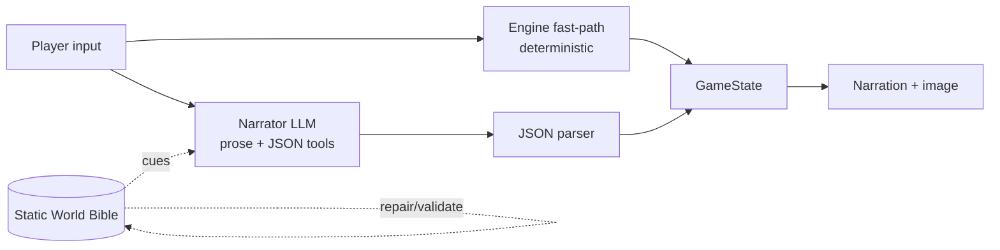
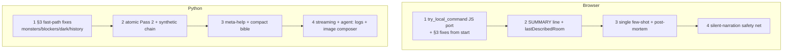

# Comparison and Best of Both Worlds

Comparison of the Python MLX engine ([llm_adventure/LMM_adventure_May_2_2026.py](llm_adventure/LMM_adventure_May_2_2026.py)) and the browser engine ([browser_adventure/adventure.html](browser_adventure/adventure.html)): feature parity, tradeoffs, fast-path risks, and a tiered plan to port improvements between them without changing the browser's Gemma 4B + SD 1.5 stack.

Sources analyzed:

- [llm_adventure/LMM_adventure_May_2_2026.py](llm_adventure/LMM_adventure_May_2_2026.py) (7,426 lines)
- [browser_adventure/adventure.html](browser_adventure/adventure.html) (3,962 lines)
- [llm_adventure/README.md](llm_adventure/README.md), [browser_adventure/README.md](browser_adventure/README.md), [browser_adventure/MAKING_ADVENTURES_GREAT_WITH_SMALL_MODELS.md](browser_adventure/MAKING_ADVENTURES_GREAT_WITH_SMALL_MODELS.md)

Hard guardrails (per user):

- Browser stays on Gemma 4 E4B (Transformers.js / WebGPU) for narration and SD 1.5 (web-txt2img worker) for art. No alternative LLMs or diffusers in the browser version.
- Python keeps MLX‑LM + MFLUX + Ollama optional path.
- No file deletions. Edits to existing files only, surgical, with clear "CHANGE (...)" comments matching repo style.

---

## 1. Architecture parity (already aligned)

Both engines share the same mental model:

Shared concepts: World Bible vs GameState split, JSON directives (`state_updates` + `images`), two‑pass world generation, auto‑repair, micro‑repair, BFS solvability validator, default cave from `browser_adventure/default_cave.json`, system instructions contract, theme presets.

---

## 2. Where each engine is *better* today

### 2a. Python is materially better at

| Area | Python (`LMM_adventure_May_2_2026.py`) | Browser (`adventure.html`) |
|---|---|---|
| Fast‑path commands | `try_local_command` at L5175 covers `help`, `inventory`, `map`, `wait`, `look`, `examine X` (inv/room/NPC/monster), multi‑item `take/get/pick up`, multi‑item `drop`, `go/enter/move X`, all cardinals (`n/s/e/w/up/down`), exact exit‑name shortcut. ~60% of typical input never reaches the LLM. | `handleTurn` at L3392 only fast‑paths `look`, `inv`, `map`. Everything else (movement, take, drop, examine) is an LLM round trip. |
| Item‑name matching | `_normalize_item_token`, `_split_item_list`, `_match_item` (L5060–5145): handles articles, snake_case↔space, apostrophes, comma + "and" lists, token containment, **partial success in same response**. | `applyLlmDirectives` uses `asArray()` for scalar/list tolerance, but the player‑facing matcher does not exist (no fast‑path for `take`). |
| Per‑turn token hygiene | `build_user_prompt` at L4711 uses `state.last_described_room` so the heavy room block is sent only on first entry; injects ONE best‑fit few‑shot only on first 3 turns or after a `[WARN]`; trims `known_map` to current+adjacent (cap 5). | `buildUserPrompt` at L2741 always emits room cues; no `lastDescribedRoom` cache; no intent‑gated single few‑shot. |
| Engine telemetry | `[WARN]` guards (`room_take MISS`, `move_to UNLINKED`, `add_items DUP`); `_format_turn_summary` emits one `[SUMMARY]` line; `format_session_postmortem` (L4949) prints rooms explored, items collected, chain steps reached, warning histogram, top solvability gaps. | Status panel + debug panel exist; no per‑turn `[SUMMARY]` line, no end‑of‑session post‑mortem. |
| Advanced directives | `apply_llm_directives` accepts `timer_event`, `conditional_action`, `chain_reaction`, narrative `mechanics` when `ADVANCED_DIRECTIVES=True` (L213, L3512). | `applyLlmDirectives` (L2389) supports the core 10 keys only; no timers / chain_reaction / conditional_action. |
| Silent‑narration safety net | After `apply_llm_directives`, if `final_text` is empty (think‑block ate the budget, JSON‑only turn, or unparseable), the UI substitutes a clear bracketed fallback explaining cause and suggesting `look / inventory / go X / take X` (L5918–5950). System prompt explicitly bans `<think>` / `<reflect>`. | Has `cleanNarration` and `removeThinking` (L823, L3013) but no equivalent guarded fallback when stripping leaves "" — turn can look frozen. |
| Help/hint discipline | `progression_hints[0]` injected in `build_user_prompt` only when `len(inventory) < 2`; `try_local_command help` shows engine commands only (no LLM). | More elaborate help: `playerWantsMetaHelp` (L2582) detects intent; `compactWorldBibleForHelp` (~1.5 KB summary) + `computeHelpContext` (next chain step, missing items) injected. **This is actually a Python‑weaker area** — see 2b. |
| Map UX | `describe_map()` visited‑only by default with `· N unexplored` hint; toggle to designer view; tracks `state.visited_rooms`. | `updateStatusPanel` shows `knownMap` lines plain; no visited‑only mode. |
| Adventure picker | `gr.Radio` collapses unselected options; "Reload Default Cave" button; load default from canonical `browser_adventure/default_cave.json` and normalize `puzzle_chain → solution_chain`. | Card picker exists; default cave is inlined as `DEFAULT_WORLD_BIBLE` and also loadable from `default_cave.json` via `PRESET_BIBLE_FILES`. Slightly better UX in browser, but Python's "single source of truth" reload is cleaner. |
| Fast‑path bookkeeping | `_post_turn_bookkeeping` (L5149) ticks `session_turns`, advances `chain_steps_completed`, and runs win/death checks for **both** fast‑path and LLM turns. Fixes a real bug where `take treasure` + `go entrance` silently never won. | Win check in `handleTurn` runs after every LLM turn but local commands (`look/inv/map`) don't tick chain progression — only matters because no other commands are local yet. |

### 2b. Browser is materially better at

| Area | Browser (`adventure.html`) | Python (`LMM_adventure_May_2_2026.py`) |
|---|---|---|
| Token streaming to UI | `runLlmGeneration` (L951) wires Transformers.js `TextStreamer`; world‑gen progress shows live `…N chars` overlay (L1871). Per‑turn `generateLlmResponse` accumulates tokens in real time. | `LLMEngine.generate` (L1518) returns a complete string; Gradio textbox is rewritten once per turn. Feels slower with large local models. |
| World‑gen agent loop on small models | `generateBrowserAtomic` (L1433) runs **5 atomic sub‑passes** (2a NPCs, 2b monsters, 2c key_items with `planItemNames` plan‑then‑act, 2d item_locations, 2e puzzle_chain **best‑of‑2** scored by `scoreChainCandidate`). `pinList` literally pins prior names as JSON arrays. Synthetic chain fallback in `autoRepairWorldBible` (L1687) guarantees a playable game. | Python uses 2‑pass + auto/micro‑repair, but Pass 2 is **single‑shot** for all of NPCs/monsters/riddles/item_locations/mechanics/solution_chain. Works on 27–35B models; would be brittle on smaller ones. No "plan‑then‑act" item planner, no best‑of‑N chain scoring. |
| Help / hint richness | `playerWantsMetaHelp` (L2582) → `compactWorldBibleForHelp` (~1.5 KB designer view) + `computeHelpContext` (missing items, next chain step, unvisited rooms, `blocked_here`) injected in‑prompt for one turn. | Only `progression_hints[0]` injected when inventory is sparse; no meta‑help intent detection; full bible visible only in the designer accordion, not the LLM context. |
| Image prompt composition | `composeImagePromptForSD` (L3542) merges room + items + NPCs + scenery + theme‑derived style; caps mood/style/key phrases (`SD_MAX_KEY_PHRASES`, `SD_MOOD_MAX_CHARS`, `SD_STYLE_MAX_CHARS`, `SD_PROMPT_MAX_CHARS`); strips other‑room mood. Per‑room blob cache in `state.roomImageBlobs`. | `generate_themed_image` + `generate_room_image_if_needed` cache by room, but the prompt construction is a string concat — no compositional/cap discipline. (Fine for FLUX which has higher token tolerance, but the *pattern* is good.) |
| Adventure picker UX | Card‑based picker with theme presets, Export/Import (world‑bible only or full save), localStorage save slots, `downloadWorldBibleToDownloads` after Ollama gen. | Gradio Radio + accordions; export goes through pickle (`StateManager.save` L1276); JSON export available in the world‑bible accordion. Less browser‑native; less visual. |
| Visible "agent: ..." reasoning | World‑gen logs `agent: planItemNames produced …`, `atomic key_items: parsed ok (6 …)`, `agent: chain candidate A=7 score=42; B=5 score=28`, `agent: picked chain candidate A`, `auto-repair: 2 fix(es)`, `solvability: OK …`. The user can *see* what the agent did. | Gen logs exist but are flatter and less narrated; no per‑step "agent:" prefix; harder to read at a glance. |
| Loading UX | Progress bar with byte counts (`progress_callback` L2946); local‑model auto‑detection via HEAD probe (`detectLocalModels` L434); WASM fallback when no WebGPU. | Designed for installed Mac stack — no cross‑machine fallback path needed, but also no progress UX during model load. |
| Synthetic walkthrough | `synthesizeAuthorWalkthrough` (L2543) generates a designer walkthrough from structured fields when the LLM omits one; included in `Export World` JSON. | No equivalent generator (default cave's walkthrough is hand‑authored). |

---

## 3. The "fast response mode" concern in the Python version

The user's worry maps to `try_local_command` (L5175 in `LMM_adventure_May_2_2026.py`). It is the right idea (saves seconds per turn on local 30B models, never desyncs `room_items`/`inventory`/`location`). But because it bypasses the LLM **entirely** for movement, take, drop, and examine, it can leak past **narrative gates the LLM would normally enforce**. Concrete risks worth fixing:

1. **Movement walks past monsters and locked exits.** L5396–5398 calls `state_mgr.move_to(move_target)` after only checking `state.known_map[location].exits`. There is no check against `world_bible.monsters` at the destination, no `blocker` lookup, no `blocked_by` flag inspection. A player can `go treasury` and skip the troll the LLM was about to describe. *Fix shape:* before moving, scan `wb.monsters` and `wb.locations[*].blockers` for the destination room and any "guard at exit" entries; if a live blocker exists (not in `state.game_flags["<name>_defeated"]`), refuse and emit a one‑line description, falling through to the LLM only if the player retries with a verb other than bare movement.

2. **`take X` ignores guarded items.** L5299–5340 picks up anything in `state.room_items[location]`. If the world‑bible says "the chest must be opened first" or "the vine‑wrapped key is held by a sprite", fast‑path grabs it anyway because `room_items` was populated during world‑bible normalization. *Fix shape:* respect a per‑item `requires_flag` (e.g. `chest_opened`) when present in `wb.item_locations` or `wb.mechanics`; otherwise fall through to LLM.

3. **`look`/`examine` ignore environmental flags.** No darkness/lit‑lantern check, no "you can't see anything" override. A "dark cave" mechanic in the bible is invisible to fast‑path. *Fix shape:* if `state.game_flags["dark"]` is true and `state.game_flags["lit"]` is false, fast‑path `look` returns "It is pitch dark." and stops.

4. **Stale narrative memory.** Fast‑path turns do **not** update `state.story_context` or append to `state.recent_history`. After 5 fast‑path moves, the LLM's next turn sees an empty conversational arc and may repeat itself or contradict events. *Fix shape:* `_post_turn_bookkeeping` (L5149) should append a one‑line synthesized history entry like `"You moved to <room> and picked up <items>."` so the LLM sees continuity.

5. **`examine X` returns raw bible fields.** L5251 / L5259 / L5269 return `key_items.purpose` / `npcs.personality` / `monsters.weakness` verbatim. That **leaks designer text** ("Weakness: silver lantern.") to the player as a free hint. *Fix shape:* either gate this behind a `--debug` flag, or rewrite the templates to be in‑character ("The lantern feels heavy and cool.").

6. **Multi‑item splitter ambiguity.** `_split_item_list` (called from L5303) splits on `,` and ` and `. A single named item like `"sword and shield"` (one item in the bible) would be split into two. Low‑probability today but easy to harden by checking the literal whole‑string against `room_items` first.

7. **Help text is engine‑centric only.** `try_local_command help` (L5189–5205) lists fast‑path verbs but doesn't tell the player *what they're trying to do*. The browser's `playerWantsMetaHelp` + `compactWorldBibleForHelp` is the better model — and it can be ported in.

8. **Fast‑path can short‑circuit a designed riddle.** If the LLM's plan is "the riddle gates the next room", `go <room>` walks straight in. Same fix as #1: respect `wb.locations[<dest>].blocker` / `wb.riddles[*].location`.

These are real concerns but the fix shape is small in every case. Item 1, 2, 4 are the highest‑impact and should land before any of the other improvements in §4–§5.

---

## 4. What to move from Python → Browser (small models need this MORE)

Per `MAKING_ADVENTURES_GREAT_WITH_SMALL_MODELS.md` Tier 1.

- **Tier 1 — biggest reliability wins**
  1. `try_local_command` port: extend browser's `handleTurn` (L3392) with `take`/`drop`/`examine`/`go X`/`n/s/e/w` using `_match_item` + `_split_item_list` + `_normalize_item_token` JS ports. Apply the §3 fixes from the start (block on monsters/blockers, append synthesized history, respect dark flag). Cite the Python sources as the verbatim port target.
  2. Per‑turn `[SUMMARY]` line in `applyLlmDirectives` (L2389): snapshot `{location, inventory, flags, health}` at start, compute deltas at end, append one line; gate the noisy per‑tool dump behind a new `VERBOSE_DEBUG` constant.
  3. `lastDescribedRoom` cache in `state` + `buildUserPrompt` (L2741): emit the heavy room cue only when `state.lastDescribedRoom !== state.location`; reset on restart/death.
  4. Single best‑fit few‑shot in `buildUserPrompt`: classify intent with a tiny keyword check (move/take/use/talk/combat/other), inject ONE example only on first 3 turns or after a `[WARN]`. Move the multiple examples currently in `SYSTEM_INSTRUCTIONS` (L694–728) to user‑prompt‑only.
  5. `formatSessionPostmortem` JS port: trigger on win/death/`New Adventure`; show rooms explored / items collected / chain steps reached / warning histogram / top solvability gaps in a modal.

- **Tier 2 — nice to have**
  6. Silent‑narration safety net: in `handleTurn`, detect empty narration after `cleanNarration` + `removeThinking` and substitute the same actionable fallback Python uses (L5918–5950 pattern). Also add the system‑prompt instruction "do not use `<think>` / `<reflect>` / `<analysis>` tags."
  7. Visited‑only map: track `state.visitedRooms`; add a `Show full map / Visited only` toggle in `updateStatusPanel` (L3143).
  8. Engine‑note feedback flag (off by default): capture `[WARN]` lines into `state.engineNotesForNextTurn`; only inject if a top‑of‑file `INJECT_ENGINE_NOTES` constant is true.
  9. In‑character rewrite of any examine/help text that leaks raw bible fields (also benefits Python — see §5).

- **Explicitly NOT moving to browser**
  - Advanced directives (`timer_event`, `conditional_action`, `chain_reaction`): too much surface area for a 4B model and adds a lot of `applyLlmDirectives` code; defer.
  - MFLUX / FLUX paths: SD 1.5 stays. (Per user constraint.)
  - Any alternative LLM path (WebLLM, Ollama as default, etc.): Gemma 4 E4B stays the in‑browser model. Ollama remains optional for **bible generation only**, as today.

---

## 5. What to move from Browser → Python

Patterns the browser invented for 4B that also help the 27–35B local models.

- **Tier 1**
  1. **Atomic Pass 2 sub‑passes** as an opt‑in path in `generate_world_bible` (L2945). Keep current single‑shot Pass 2 as default for 30B+ models; add a `USE_ATOMIC_PASS2` env flag (mirror `USE_ATOMIC_PASS2` in `adventure.html` L408) that triggers `_generate_world_atomic` running 2a NPCs → 2b monsters → 2c key_items (with `_plan_item_names` plan‑then‑act) → 2d item_locations → 2e solution_chain best‑of‑2 with `_score_chain_candidate`. Auto‑select for any model under ~12B in `~/MLX_Models` or any Ollama tag matching `\b[1-9]b\b`. Most code is already a near‑copy of the browser's `generateBrowserAtomic` (L1433), `runAtomicPass` (L1149), `pinList`, `scoreChainCandidate`.
  2. **Synthetic chain fallback** in `auto_repair_world_bible` (L2442): if `solution_chain` has < 3 steps after auto‑repair, build one deterministically (ordered collect steps + travel + final win step) so the game is **always** playable. This is `autoRepairWorldBible` step 3b in `adventure.html` (L1687–1737).
  3. **`playerWantsMetaHelp` + compact bible injection** in `build_user_prompt` (L4711). When the user asks for help/hint/stuck/goals/walkthrough/etc. (mirror the regex in `adventure.html` L2582), inject a compact bible summary + `compute_help_context()` (next chain step, missing items, unvisited rooms, blockers here) for THIS turn only. Keep designer accordion as a separate full‑bible view.
  4. **Compositional image prompt** in `generate_room_image_if_needed` / `generate_themed_image` (L368, L471): port `composeImagePromptForSD` (L3542) — room + items + NPCs + scenery + capped style suffix. FLUX tolerates more text but the discipline reduces drift across rooms.

- **Tier 2**
  5. **Token streaming to Gradio UI**: replace the single‑shot `mlx_generate` call in `LLMEngine.generate` (L1518) with a streaming variant (MLX‑LM supports a streaming generator); push partial chunks into the Gradio textbox via `yield`. Big perceived‑latency win on 30B+ local models.
  6. **`agent:` prefixed gen logs** — uniformly relabel world‑gen `[gen]`/`[debug]` lines to `agent:` style ("agent: planItemNames produced 6 candidates", "agent: picked chain candidate A (7 steps)", "auto-repair: 2 fix(es) applied", "solvability: OK"). Pure cosmetic but matches the browser's at‑a‑glance scanning.
  7. **`synthesizeAuthorWalkthrough` JS → Python port**: when `solution_chain` exists but `author_walkthrough` is empty, synthesize one from structured fields and include it in pickle export.
  8. **Loading progress UI** in Gradio Setup tab: show MLX model load progress (size in MB streamed, % loaded) while `LLMEngine.load` runs; mirror the browser's progress bar UX.

- **Explicitly NOT moving to Python**
  - localStorage save slots (Gradio has filesystem; pickle is fine).
  - WebGPU / WASM fallback (Python has MLX).
  - Browser detection of local models (Python lists `~/MLX_Models` and `~/Diffusion_Models` already).

---

## 6. Sequencing (suggested, both engines in parallel)

Each step is small (one helper function + 1–3 call‑sites) and committable independently. No step requires changing `default_cave.json`, the SD 1.5 worker, the MFLUX path, or the model picker.

---

## Implementation todos

The first todo on each side is the §3 fast-path hardening for Python and the fast-path port for the browser — these unlock everything else and have the highest user-visible impact.
