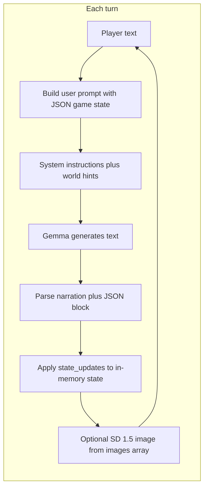

# JMR's LLM Adventure — browser edition

This folder holds the **standalone in-browser** version of the LLM adventure engine (the same design as [`../llm_adventure/LMM_adventure_Feb_15_26.py`](../llm_adventure/LMM_adventure_Feb_15_26.py), but implemented in one HTML file plus shared image workers).

| File | Role |
|------|------|
| [`adventure.html`](adventure.html) | Full game UI + engine (Gemma 4B + SD 1.5) |
| This README | How narration, state, and customization work |

**Play on GitHub Pages (no install):**  
[https://jmrothberg.github.io/Collosol-Cave-with-local-LLM/browser_adventure/adventure.html](https://jmrothberg.github.io/Collosol-Cave-with-local-LLM/browser_adventure/adventure.html)

Short URL (repo-root redirect stub):  
[https://jmrothberg.github.io/Collosol-Cave-with-local-LLM/adventure.html](https://jmrothberg.github.io/Collosol-Cave-with-local-LLM/adventure.html)

**Link previews (Slack, Discord, iMessage, etc.):** `adventure.html` and the redirect stubs include Open Graph / Twitter Card tags pointing at [`og-preview.png`](og-preview.png) on GitHub Pages. After deploy, pasting any of the URLs above should unfurl with that image (crawlers cache; use [Facebook Sharing Debugger](https://developers.facebook.com/tools/debug/) to refresh if needed).

---

## How you must serve this folder

`adventure.html` loads image code from **`../llm_adventure/vendor/web-txt2img/`** (same-origin worker). That path only exists if the HTTP server’s **document root is the repository root** (`Colossal_Cave/`), not `llm_adventure/` alone.

```bash
cd /path/to/Colossal_Cave   # repo root
python3 scripts/serve-threaded.py 8080
# Open http://localhost:8080/browser_adventure/adventure.html
```

> **Why not `python3 -m http.server`?** The built-in server lacks the `Cross-Origin-Opener-Policy` and `Cross-Origin-Embedder-Policy` headers needed for `crossOriginIsolated` mode. Without them, ONNX Runtime Web falls back to single-threaded WASM (much slower).

If you previously used `cd llm_adventure && python3 -m http.server`, use the repo root instead for this game. A redirect stub remains at [`../llm_adventure/adventure.html`](../llm_adventure/adventure.html) that sends the browser to `/browser_adventure/adventure.html` when the root server is used.

---

## Models — internet vs. local

### Default: just open the page (internet required)

Most users don't need to download anything manually. Open the GitHub Pages link (or serve locally) and the browser fetches models from HuggingFace Hub on first load, then caches them:

| Model | Source | Size | Purpose |
|-------|--------|------|---------|
| **Gemma 4 E4B** (ONNX q4) | `onnx-community/gemma-4-E4B-it-ONNX` | ~3.1 GB | Text generation (narrator + game master) |
| **SD 1.5** (MS WebNN ONNX fp16) | `microsoft/stable-diffusion-v1.5-webnn` | ~1.9 GB | Scene illustration |
| **CLIP tokenizer** | `Xenova/clip-vit-base-patch16` | ~2 MB | Prompt encoding for SD 1.5 |

First load is **~5 GB** total (browser-cached afterward). **WebGPU** (Chrome/Edge 113+) is strongly recommended; WASM fallback works but is much slower.

### Optional: fully offline / local files

For faster loading or air-gapped machines, download the model files once to `local_models/` in the repo root. The game auto-detects each model independently on localhost — you can have the LLM local and SD remote, or both local.

**Prerequisite:** `pip install huggingface_hub` (one time).

```bash
cd /path/to/Colossal_Cave
python3 -c "
from huggingface_hub import snapshot_download
# Gemma 4 E4B ONNX (q4) — ~3.1 GB
snapshot_download('onnx-community/gemma-4-E4B-it-ONNX',
    allow_patterns=['config.json','generation_config.json','tokenizer.json',
        'tokenizer_config.json','preprocessor_config.json','processor_config.json',
        'onnx/decoder_model_merged_q4.onnx','onnx/decoder_model_merged_q4.onnx_data',
        'onnx/decoder_model_merged_q4.onnx_data_1'],
    local_dir='local_models/onnx-community/gemma-4-E4B-it-ONNX')
# SD 1.5 ONNX (fp16) — ~1.9 GB
snapshot_download('microsoft/stable-diffusion-v1.5-webnn',
    allow_patterns=['text-encoder.onnx',
        'sd-unet-v1.5-model-b2c4h64w64s77-float16-compute-and-inputs-layernorm.onnx',
        'Stable-Diffusion-v1.5-vae-decoder-float16-fp32-instancenorm.onnx'],
    local_dir='local_models/microsoft/stable-diffusion-v1.5-webnn')
# CLIP tokenizer (used by SD 1.5) — ~2 MB
snapshot_download('Xenova/clip-vit-base-patch16',
    allow_patterns=['tokenizer.json','tokenizer_config.json','config.json'],
    local_dir='local_models/Xenova/clip-vit-base-patch16')
"
```

Total: **~5.1 GB**. The `local_models/` directory is git-ignored.

When serving from localhost, the game probes for each model's files at startup and reports what it found (e.g. "Local model files detected (LLM + SD 1.5)"). Any model not found locally falls back to the normal HuggingFace download.

---

## What “generates” the story?

The story is **not** a fixed script. Each beat is produced by a **text-generation model** (Gemma 4 E4B ONNX) acting as **narrator + game master**. The page does not run a hand-authored plot tree; it runs a **loop**:



1. **Your input** (e.g. “pick up the torch”, “go north”) is appended to a **structured snapshot** of the game (location, inventory, map, flags, notes, recent dialogue).
2. The model receives **system instructions** that tell it exactly how to format its reply: prose first, then a fenced ` ```json ` block with `state_updates` and `images`.
3. JavaScript **strips** the JSON from what you read and **applies** the directives (move, connect rooms, items, health, flags, etc.).
4. **Images** are separate: the first image prompt (plus a fixed art-style suffix) is sent to **Stable Diffusion 1.5** in a Web Worker. Room images are **cached in memory** (blob URLs) so revisiting a room does not always re-render.

So: **the LLM invents the wording and proposes state changes**; **the engine enforces structure** by parsing JSON and updating a single canonical `GameState` object.

---

## Two layers of “story logic”

### 1. World Bible (static, embedded in `adventure.html`)

Near the top of the script section, the object **`DEFAULT_WORLD_BIBLE`** is a **design document**: objectives, locations, NPCs, monsters, riddles, key items, item locations, progression hints, mechanics, win condition, and a global image theme string.

- The LLM **does not** have to follow it literally every turn, but **`buildUserPrompt()`** injects **excerpts** relevant to the **current room** (NPCs here, monsters here, puzzles here, hints, current objective, etc.).
- That steers tone, consistency, and puzzle structure without hard-coding dialogue trees.

Changing this object is the main way to get a **different setting** without rewriting the whole engine.

### 2. System instructions (behavior contract)

The string **`SYSTEM_INSTRUCTIONS`** tells the model:

- Write **2–5 sentences** of visible narration.
- Then output **one JSON object** (in ` ```json ` fences) with:
  - **`state_updates`**: tools like `move_to`, `connect`, `place_items`, `room_take`, `add_items`, `remove_items`, `change_health`, `set_context`, `set_flag`, `add_note`.
  - **`images`**: at least one short **English** visual description for the scene (used as an SD prompt fragment).

The engine **only** changes inventory, map, health, etc. when those fields appear in parsed JSON. If the model forgets JSON or breaks syntax, you may get **narration-only** turns (see Debug panel) with little or no state change.

---

## Opening scene vs. later turns

- **Start:** `startStory()` sends a **kickoff** user message: start a new adventure, describe the opening, set a location with exits, place a starter item, include an image prompt. It also prepends a **compact summary** derived from `DEFAULT_WORLD_BIBLE` (objectives, NPCs, sample locations).
- **Later turns:** `buildUserPrompt()` sends the **live JSON state** plus **room-specific world bible lines** plus `Player says: …`.

Temperature and `max_new_tokens` are set in `adventure.html` (defaults: creative enough for variety, bounded enough for JSON).

---

## How to create a custom story (practical guide)

All edits are in **[`adventure.html`](adventure.html)** (search within the file).

### A. New setting, same mechanics

1. Replace or edit **`DEFAULT_WORLD_BIBLE`**:
   - **`locations`**: names + short descriptions (used for hints and win heuristics).
   - **`npcs`**, **`monsters`**, **`riddles`**, **`key_items`**, **`item_locations`**, **`objectives`**, **`win_condition`**, **`progression_hints`**, **`mechanics`**.
2. Set **`global_theme`** / **`theme`** to a string that describes art direction; **`IMAGE_THEME`** is also appended to SD prompts—keep them aligned for consistent pictures.
3. Optionally adjust **`SYSTEM_INSTRUCTIONS`** examples so they match your genre (e.g. sci-fi room names instead of caves).

### B. Stricter or looser narrator behavior

- Tweak **`SYSTEM_INSTRUCTIONS`**: length of narration, required JSON keys, emphasis on `room_take` vs `add_items`, etc.
- Adjust **`LLM_TEMPERATURE`** and **`LLM_MAX_TOKENS`**: higher temperature = more variety, more risk of invalid JSON; lower = more repetitive, often cleaner JSON.

### C. Different default opening

Edit the **`kickoff`** string inside **`startStory()`** (what the model sees for the very first generation).

### D. Image look

- **`IMAGE_THEME`**: appended to every SD prompt.
- **`IMG_STEPS`** / **`IMG_GUIDANCE`**: quality vs. speed (SD 1.5).

### E. Different LLM or image model

- **`LLM_MODEL_ID`**: any Transformers.js ONNX chat model you have tested (this project defaults to Gemma 4 E4B).
- **`IMG_MODEL_ID`**: wired to `web-txt2img` registry (default `sd-1.5`). Changing this may require different `generate()` parameters—see [`../llm_adventure/diffusers-webgpu-compare-test.html`](../llm_adventure/diffusers-webgpu-compare-test.html).

---

## JSON directives reference (browser subset)

| Key | Meaning |
|-----|--------|
| `move_to` | Player location (string). |
| `connect` | `[[roomA, roomB], …]` bidirectional exits. |
| `place_items` | Items added to **current** room. |
| `room_take` | Pick up from room → inventory (preferred over abusing `add_items`). |
| `add_items` / `remove_items` | Direct inventory changes; overlap is treated like a mistaken `room_take`. |
| `change_health` | Integer delta. |
| `set_context` | LLM “memory” string stored in state. |
| `set_flag` | `{ name, value }` in `game_flags`. |
| `add_note` | Quest log line. |
| `images` | String array; first entry drives SD when a new room image is needed. |

Win detection uses **`win_condition`** text plus **`game_flags`** / inventory heuristics (see `checkWinCondition` in the script).

---

## Adventure generation, save/load, and preset themes

The browser version now supports adventure generation, save/load, and preset themes:

- **World Bible Generation**: use the in-browser Gemma 4B to generate a new adventure from a theme description. Pick a preset theme (Tolkien, Star Wars, Colossal Cave, Zork, Myst, Pirate, Cyberpunk) or write your own. Generation takes 30-90 seconds.
- **Save/Load**: save game state + world bible to browser `localStorage`. Resume later from the adventure picker.
- **JSON Import/Export**: import a `.json` world bible (like [`default_cave.json`](default_cave.json)) or a full save (world bible + game state) from a file. **Save game** (in the header) stores world bible + progress in this browser only. **Export World** downloads the world bible only—no inventory or flags—so you can share or edit the setting; use **Save game** to keep your place.
- **Pre-game Adventure Picker**: choose default cave, generate new, or load saved before starting.
- **In-game buttons**: Save game, Export World, and New Adventure in the header bar.

The active world bible is stored in `activeWorldBible` (defaults to `DEFAULT_WORLD_BIBLE`). All game engine functions reference this mutable variable, so swapping it changes the entire adventure.

## What the Python game has that the browser build does not

The browser page is intentionally smaller in a few areas:

- No **MFLUX** / local FLUX paths; images are **only** SD 1.5 via ONNX in the worker.
- **Advanced directives** from the Python engine (timers, chain reactions, etc.) are not implemented in the browser `applyLlmDirectives`—only the table above.
- World bible generation uses the **same Gemma 4B** model (vs. a separate heavier model in Python), so generated bibles may be simpler.

For full feature parity, run [`../llm_adventure/LMM_adventure_Feb_15_26.py`](../llm_adventure/LMM_adventure_Feb_15_26.py) on Apple Silicon.

---

## Dependencies (all loaded automatically)

- **Gemma 4 E4B** — ONNX q4, loaded via [`@huggingface/transformers`](https://huggingface.co/docs/transformers.js) (3.1 GB).
- **SD 1.5** — Microsoft WebNN ONNX fp16, loaded via **`../llm_adventure/vendor/web-txt2img/`** (1.9 GB).
- **CLIP tokenizer** — used by SD 1.5 for prompt encoding, loaded via `@xenova/transformers` or `@huggingface/transformers` (2 MB).

See [Models — internet vs. local](#models--internet-vs-local) above for download details and sizes.

---

## More documentation

- Overview and repo layout: [`../llm_adventure/README.md`](../llm_adventure/README.md)
- Python engine source (full prompts, validation, image pipeline): [`../llm_adventure/LMM_adventure_Feb_15_26.py`](../llm_adventure/LMM_adventure_Feb_15_26.py)
