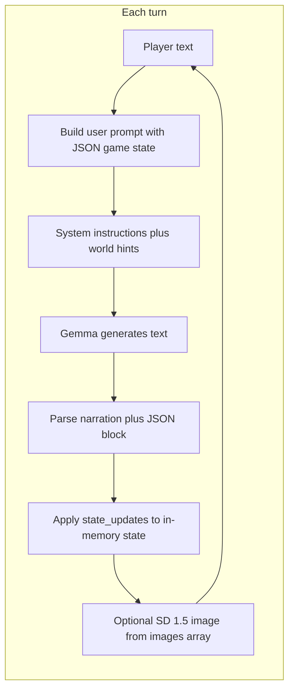

# JMR's LLM Adventure — browser edition

In-browser text adventure: **Gemma 4B** (Transformers.js) narrates and runs game logic; **Stable Diffusion 1.5** draws scenes. Same design idea as the Python engine [`../llm_adventure/LMM_adventure_Feb_15_26.py`](../llm_adventure/LMM_adventure_Feb_15_26.py).

| File | Role |
|------|------|
| [`adventure.html`](adventure.html) | Full game UI + engine |
| This README | Setup, generation, save/load, JSON behavior |

---

## Quick start (GitHub Pages — recommended)

**No install.** Use a recent **Chrome or Edge** with **WebGPU** if you can (first visit downloads ~5 GB of models from HuggingFace, then caches them).

| Link | Notes |
|------|--------|
| **[Play (full URL)](https://jmrothberg.github.io/Collosol-Cave-with-local-LLM/browser_adventure/adventure.html)** | Main entry point |
| **[Short redirect](https://jmrothberg.github.io/Collosol-Cave-with-local-LLM/adventure.html)** | Repo-root stub → same game |

GitHub Pages serves the **whole repository**, so `adventure.html` can load `../llm_adventure/vendor/web-txt2img/` correctly. You do **not** need a local Python server just to play the hosted build.

**Link previews** (Slack, Discord, iMessage): Open Graph / Twitter tags point at [`og-preview.png`](og-preview.png). Crawlers cache; refresh with [Facebook Sharing Debugger](https://developers.facebook.com/tools/debug/) if needed.

---

## Local development server (optional, faster COOP/COEP)

For hacking on the repo locally, serve from the **repository root** (`Colossal_Cave/`), not from `browser_adventure/` alone — the page loads workers from **`../llm_adventure/vendor/web-txt2img/`**.

```bash
cd /path/to/Colossal_Cave   # repo root
python3 scripts/serve-threaded.py 8080
# Open http://localhost:8080/browser_adventure/adventure.html
```

> **Why not `python3 -m http.server`?** The default module does not send `Cross-Origin-Opener-Policy` / `Cross-Origin-Embedder-Policy`, so the page may not get `crossOriginIsolated` and ONNX can fall back to slower single-threaded WASM.

A redirect stub lives at [`../llm_adventure/adventure.html`](../llm_adventure/adventure.html) when the root server is used.

---

## Models — internet vs. local

### Default: just open the page (internet required)

Most users don't need to download anything manually. Open the GitHub Pages link (or serve locally) and the browser fetches models from HuggingFace Hub on first load, then caches them:

| Model | Source | Size | Purpose |
|-------|--------|------|---------|
| **Gemma 4 E4B** (ONNX q4) | `onnx-community/gemma-4-E4B-it-ONNX` | ~3.1 GB | Text generation (narrator + game master) |
| **SD 1.5** (MS WebNN ONNX fp16) | `microsoft/stable-diffusion-v1.5-webnn` | ~1.9 GB | Scene illustration |
| **CLIP tokenizer** | `Xenova/clip-vit-base-patch16` | ~2 MB | Prompt encoding for SD 1.5 |

First load is **~5 GB** total (browser-cached afterward). **WebGPU** (Chrome/Edge 113+) is strongly recommended; WASM fallback works but is much slower.

### Optional: fully offline / local files

For faster loading or air-gapped machines, download the model files once to `local_models/` in the repo root. The game auto-detects each model independently on localhost — you can have the LLM local and SD remote, or both local.

**Prerequisite:** `pip install huggingface_hub` (one time).

```bash
cd /path/to/Colossal_Cave
python3 -c "
from huggingface_hub import snapshot_download
# Gemma 4 E4B ONNX (q4) — ~3.1 GB
snapshot_download('onnx-community/gemma-4-E4B-it-ONNX',
    allow_patterns=['config.json','generation_config.json','tokenizer.json',
        'tokenizer_config.json','preprocessor_config.json','processor_config.json',
        'chat_template.jinja',
        'onnx/decoder_model_merged_q4.onnx','onnx/decoder_model_merged_q4.onnx_data',
        'onnx/decoder_model_merged_q4.onnx_data_1'],
    local_dir='local_models/onnx-community/gemma-4-E4B-it-ONNX')
# SD 1.5 ONNX (fp16) — ~1.9 GB
snapshot_download('microsoft/stable-diffusion-v1.5-webnn',
    allow_patterns=['text-encoder.onnx',
        'sd-unet-v1.5-model-b2c4h64w64s77-float16-compute-and-inputs-layernorm.onnx',
        'Stable-Diffusion-v1.5-vae-decoder-float16-fp32-instancenorm.onnx'],
    local_dir='local_models/microsoft/stable-diffusion-v1.5-webnn')
# CLIP tokenizer (used by SD 1.5) — ~2 MB
snapshot_download('Xenova/clip-vit-base-patch16',
    allow_patterns=['tokenizer.json','tokenizer_config.json','config.json'],
    local_dir='local_models/Xenova/clip-vit-base-patch16')
"
```

Total: **~5.1 GB**. The `local_models/` directory is git-ignored.

When serving from localhost, the game probes for each model's files at startup and reports what it found (e.g. "Local model files detected (LLM + SD 1.5)"). Any model not found locally falls back to the normal HuggingFace download.

---

## What “generates” the story?

The story is **not** a fixed script. Each beat is produced by a **text-generation model** (Gemma 4 E4B ONNX) acting as **narrator + game master**. The page does not run a hand-authored plot tree; it runs a **loop**:



1. **Your input** (e.g. “pick up the torch”, “go north”) is appended to a **structured snapshot** of the game (location, inventory, map, flags, notes, recent dialogue).
2. The model receives **system instructions** that tell it exactly how to format its reply: prose first, then a fenced ` ```json ` block with `state_updates` and `images`.
3. JavaScript **strips** the JSON from what you read and **applies** the directives (move, connect rooms, items, health, flags, etc.).
4. **Images** are separate: the first image prompt (plus a fixed art-style suffix) is sent to **Stable Diffusion 1.5** in a Web Worker. Room images are **cached in memory** (blob URLs) so revisiting a room does not always re-render.

So: **the LLM invents the wording and proposes state changes**; **the engine enforces structure** by parsing JSON and updating a single canonical `GameState` object.

---

## Two layers of “story logic”

### 1. World Bible (static, embedded in `adventure.html`)

Near the top of the script section, the object **`DEFAULT_WORLD_BIBLE`** is a **design document**: objectives, locations, NPCs, monsters, riddles, key items, item locations, progression hints, mechanics, win condition, and a global image theme string.

- The LLM **does not** have to follow it literally every turn, but **`buildUserPrompt()`** injects **excerpts** relevant to the **current room** (NPCs here, monsters here, puzzles here, hints, current objective, etc.).
- That steers tone, consistency, and puzzle structure without hard-coding dialogue trees.

Changing this object is the main way to get a **different setting** without rewriting the whole engine.

### 2. System instructions (behavior contract)

The string **`SYSTEM_INSTRUCTIONS`** tells the model:

- Write **2–5 sentences** of visible narration.
- Then output **one JSON object** (in ` ```json ` fences) with:
  - **`state_updates`**: tools like `move_to`, `connect`, `place_items`, `room_take`, `add_items`, `remove_items`, `change_health`, `set_context`, `set_flag`, `add_note`.
  - **`images`**: at least one short **English** visual description for the scene (used as an SD prompt fragment).

The engine **only** changes inventory, map, health, etc. when those fields appear in parsed JSON. If the model forgets JSON or breaks syntax, you may get **narration-only** turns (see Debug panel) with little or no state change.

---

## Opening scene vs. later turns

- **Start:** `startStory()` sends a **kickoff** user message: start a new adventure, describe the opening, set a location with exits, place a starter item, include an image prompt. It also prepends a **compact summary** derived from `DEFAULT_WORLD_BIBLE` (objectives, NPCs, sample locations).
- **Later turns:** `buildUserPrompt()` sends the **live JSON state** plus **room-specific world bible lines** plus `Player says: …`.

Temperature and `max_new_tokens` are set in `adventure.html` (defaults: creative enough for variety, bounded enough for JSON).

---

## How to create a custom story (practical guide)

All edits are in **[`adventure.html`](adventure.html)** (search within the file).

### A. New setting, same mechanics

1. Replace or edit **`DEFAULT_WORLD_BIBLE`**:
   - **`locations`**: names + short descriptions (used for hints and win heuristics).
   - **`npcs`**, **`monsters`**, **`riddles`**, **`key_items`**, **`item_locations`**, **`objectives`**, **`win_condition`**, **`progression_hints`**, **`mechanics`**.
2. Set **`global_theme`** / **`theme`** to a string that describes art direction; **`IMAGE_THEME`** is also appended to SD prompts—keep them aligned for consistent pictures.
3. Optionally adjust **`SYSTEM_INSTRUCTIONS`** examples so they match your genre (e.g. sci-fi room names instead of caves).

### B. Stricter or looser narrator behavior

- Tweak **`SYSTEM_INSTRUCTIONS`**: length of narration, required JSON keys, emphasis on `room_take` vs `add_items`, etc.
- Adjust **`LLM_TEMPERATURE`** and **`LLM_MAX_TOKENS`**: higher temperature = more variety, more risk of invalid JSON; lower = more repetitive, often cleaner JSON.

### C. Different default opening

Edit the **`kickoff`** string inside **`startStory()`** (what the model sees for the very first generation).

### D. Image look

- **`IMAGE_THEME`**: appended to every SD prompt.
- **`IMG_STEPS`** / **`IMG_GUIDANCE`**: quality vs. speed (SD 1.5).

### E. Different LLM or image model

- **`LLM_MODEL_ID`**: any Transformers.js ONNX chat model you have tested (this project defaults to Gemma 4 E4B).
- **`IMG_MODEL_ID`**: wired to `web-txt2img` registry (default `sd-1.5`). Changing this may require different `generate()` parameters—see [`../llm_adventure/diffusers-webgpu-compare-test.html`](../llm_adventure/diffusers-webgpu-compare-test.html).

---

## JSON directives reference (browser subset)

| Key | Meaning |
|-----|--------|
| `move_to` | Player location (string). |
| `connect` | `[[roomA, roomB], …]` bidirectional exits. |
| `place_items` | Items added to **current** room. |
| `room_take` | Pick up from room → inventory (preferred over abusing `add_items`). |
| `add_items` / `remove_items` | Direct inventory changes; overlap is treated like a mistaken `room_take`. |
| `change_health` | Integer delta. |
| `set_context` | LLM “memory” string stored in state. |
| `set_flag` | `{ name, value }` in `game_flags`. |
| `add_note` | Quest log line. |
| `images` | String array; first entry drives SD when a new room image is needed. |

Win detection uses **`win_condition`** text plus **`game_flags`** / inventory heuristics (see `checkWinCondition` in the script).

---

## Adventure picker: default, generate, load

Before **Start Adventure**, pick one card:

| Card | What you get |
|------|----------------|
| **Default Cave Adventure** | Built-in world (Starfire Gem / Cave Mouth, etc.). No LLM world build. |
| **Generate New Adventure** | Two-pass LLM build from your theme (preset dropdown or custom text). |
| **Load Saved Adventure** | Browser **Save game** slots, or **import JSON** (world bible or full save). |

**Important:** To get a **new** Tolkien/Zork/etc. world, choose **Generate New Adventure** (card must be selected), enter or pick a theme, then **Start**. If you only see the default cave, you either picked **Default Cave** or generation failed (see Debug).

---

## World bible generation (Gemma vs Ollama)

**Generate New Adventure** can build the world bible two ways:

1. **In-browser Gemma** (checkbox **off**) — same model as gameplay; often 30–90s; can be weaker at JSON.
2. **Local Ollama** (checkbox **on**) — your Mac/PC runs the map + content passes; gameplay still uses Gemma in the browser.

After a successful **Ollama** build, a **`world_bible_*.json`** is saved to your **Downloads** folder (same idea as **Export World**).

### Ollama setup (short checklist)

1. **Install Ollama** on the same machine as the browser — [ollama.com](https://ollama.com).
2. **Pull a model:** `ollama pull gemma4:12b` (or any model you like). Use the **exact** name from `ollama list` in the game UI.
3. **Start Ollama with CORS enabled.** The game’s browser tab needs permission to call `http://127.0.0.1:11434`. Open a terminal and run:

   ```bash
   OLLAMA_ORIGINS="https://jmrothberg.github.io,http://localhost:*,http://127.0.0.1:*" ollama serve
   ```

   **That’s it.** Works on Mac, Linux, and WSL. Covers both GitHub Pages and local use. The setting is temporary — it only lasts while the terminal is open and does not change any system config.

   > **If you see `address already in use`:** the Mac Ollama desktop app (or another `ollama serve`) is already running. Quit it first (menu-bar llama icon → Quit Ollama), then run the command above. For forks replace `jmrothberg` with your GitHub username.

4. Status lines under the progress bar show **`[Ollama · model]`** vs **`[Gemma world-gen]`** so you always see which backend is generating.

### Ollama troubleshooting (Debug panel)

Open **Debug** after a failed or odd run:

- **`[Ollama API]`** — HTTP status, `format=json`, `num_predict`, **`done_reason=length`** (hit token cap), and raw JSON when needed.
- **`FAILURE:`** — first explanation when generation falls back to the built-in cave.
- **`active: generation failed → built-in default`** — read **`FAILURE:`** and **`[Ollama API]`** lines right below the header.

Empty replies trigger retries (single user message, then `/api/generate`). Pass 1 uses **JSON mode** and **larger `num_predict`** than the old 800-token cap so map JSON is not truncated as often.

---

## Save / load / export

- **Save game** (header): world bible + progress → this browser’s `localStorage` only.
- **Export World**: downloads **world bible JSON** only (no inventory). Good for sharing or editing.
- **Import JSON**: world bible like [`default_cave.json`](default_cave.json), or a full save with `gameState`.
- **New Adventure**: returns to the picker (models stay cached if already loaded).

The live setting is **`activeWorldBible`** (starts as **`DEFAULT_WORLD_BIBLE`** in `adventure.html`).

---

## Help, hints, and solvability

**Fast local commands (no LLM):** **`look`**, **`inventory`** / **`inv`**, **`map`**. Everything else—including **`help`**, **`hint`**, goals, strategy, or “what should I do”—goes through the **narrator LLM** in one turn.

**Normal play (lean prompt):** The model gets **current state JSON** plus **this room’s** bible cues (description, NPCs, monsters, blockers, items tied to this room). It does **not** get a scripted “next puzzle step” line every turn; pacing and hint strength are up to the model.

**Meta-help (richer prompt, same single call):** If the input looks like meta help (e.g. starts with **`help`**, **`hint`**, **`stuck`**, **`goals`**, **`how do i win`**, **`what should i do`**, **`walkthrough`**, **`any hints`**—see `playerWantsMetaHelp` in `adventure.html`), the user prompt also includes **`FULL_WORLD_BIBLE_JSON`**: the **entire** world bible so the LLM can answer from the full design. System instructions tell it to use **discretion** (nudge vs detailed plan) and not dump raw JSON unless the player asks.

**Generation:** Pass 2 is instructed to keep **`puzzle_chain`** **logically solvable** and consistent with items/NPCs/rooms, and to write **`author_walkthrough`** aligned with that chain. If the model omits it, the engine **synthesizes** a walkthrough from structured fields.

**Full written solution (debug only):** Open **Debug**, expand the world bible block, then **“Designer walkthrough (full spoiler — debug only)”**. There is **no** in-game cheat phrase.

**Export World** includes **`author_walkthrough`** in the JSON for offline reading or editing.

## What the Python game has that the browser build does not

The browser page is intentionally smaller in a few areas:

- No **MFLUX** / local FLUX paths; images are **only** SD 1.5 via ONNX in the worker.
- **Advanced directives** from the Python engine (timers, chain reactions, etc.) are not implemented in the browser `applyLlmDirectives`—only the table above.
- World bible generation defaults to the **same Gemma 4B** model as gameplay (vs. a separate heavier model in Python), so generated bibles may be simpler unless you use **local Ollama** for the build step.

For full feature parity, run [`../llm_adventure/LMM_adventure_Feb_15_26.py`](../llm_adventure/LMM_adventure_Feb_15_26.py) on Apple Silicon.

---

## Dependencies (all loaded automatically)

- **Gemma 4 E4B** — ONNX q4, loaded via [`@huggingface/transformers`](https://huggingface.co/docs/transformers.js) (3.1 GB).
- **SD 1.5** — Microsoft WebNN ONNX fp16, loaded via **`../llm_adventure/vendor/web-txt2img/`** (1.9 GB).
- **CLIP tokenizer** — used by SD 1.5 for prompt encoding, loaded via `@xenova/transformers` or `@huggingface/transformers` (2 MB).

See [Models — internet vs. local](#models--internet-vs-local) above for download details and sizes.

---

## More documentation

- Overview and repo layout: [`../llm_adventure/README.md`](../llm_adventure/README.md)
- Python engine source (full prompts, validation, image pipeline): [`../llm_adventure/LMM_adventure_Feb_15_26.py`](../llm_adventure/LMM_adventure_Feb_15_26.py)
